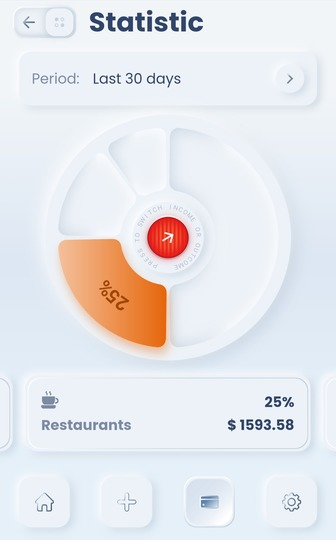
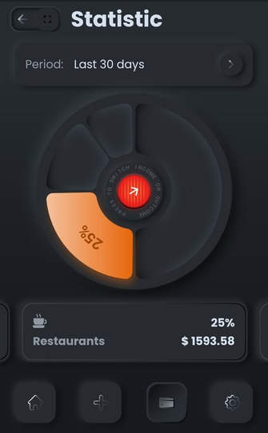

# skeuomorph_mobile_banking

This is a test flutter project for practice in skeuomorph design implementation.

## About 

Found this excellent design [on Dribbble](https://dribbble.com/shots/7994421-Skeuomorph-Mobile-Banking)

There is only a statistic screen with switching between light and dark themes. Theme state stored in [shared preferences](https://pub.dev/packages/shared_preferences). I get state and change it using [Provider](https://pub.dev/packages/provider).

The visual effect of convex/concave widgets is achieved by combining inner and outer light and dark shadows.

And my favourite part is the pie chart. I didn't find any ready solution, so I painted it completely on canvas. 

See result below. 

## How it looks

Here is a video [on YouTube](https://youtu.be/o4ZTyWN0h9c) to see implementation and animation.

### Screenshots

